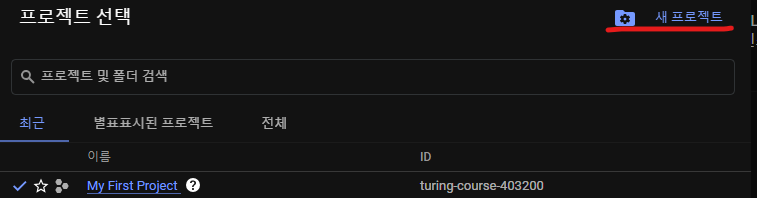
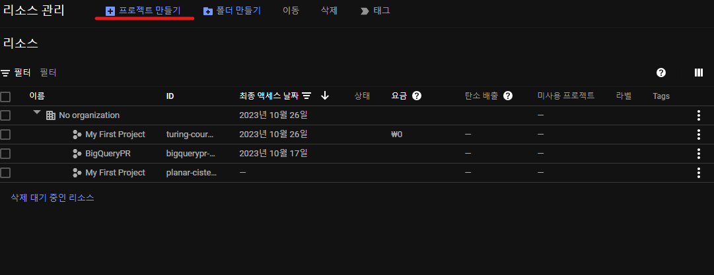

# Cloud SQL을 사용하여 MySQL 인스턴스 만들기

1. Google CLoud 프로젝트에서 Cloud SQL을 사용 설정합니다. 
2. Google Cloud 콘솔을 사용하여 MySQL 인스턴스를 만듭니다.
3. Cloud Shell을 사용하여 MySQL 인스턴스에 연결
4. 데이터베이스를 만들고 데이터베이스에 데이터를 업로드하여 기본 SQL 작업을 수행합니다.
5. 요금이 청구되지 않도록 삭제

### 새 프로젝트 만들기
기존에 프로젝트가 있었다면 프로젝트를  설정하면 된다.

만약 프로젝트가 없다면 상단 이미지의 우측에 있는 My First Project가 있는 라디오 버튼을 토글한다.
그럼 다음과 같은 UI가 표시될 텐데, 

우측 상단의 새 프로젝트 생성을 눌러주면 된다.
이후 다음과 같은 화면이 나왔을 때 <U>프로젝트 만들기</U>를 클릭해주면 된다.

디렉토리 정렬이 필요하다면 위에 폴더 만들기를 통해 정리를 하면 된다.
해당 프로젝트에 요금이 부과되는 것을 확인하고 싶다면 해당 페이지에서 요금을 보면 되고 우측의 
 버튼을 눌러 삭제 버튼을 눌러 해당 프로젝트를 제거하고 요금 부과를 중단시킬 수 도 있다.

