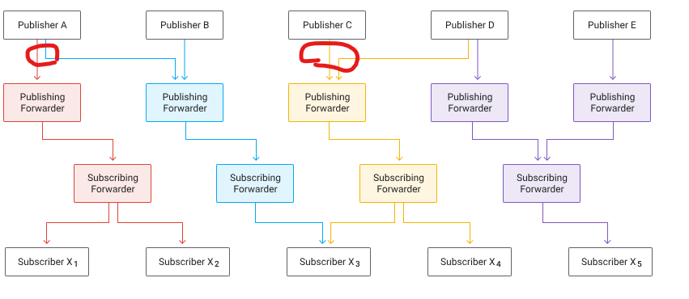

# Pub/Sub
> Pub/Sub는 <U>안전성</U>과 <U>확장성</U>이 뛰어난 비동기 메시징 서비스

### Pub/Sub 이 존재하는 이유...
> Google ads, Google Search engine 같은 같은 대규모의 트래픽을 가진 서비스에서 제일 중여한 점이 무엇일까?

#### 얼마나 빠르게 사용자에게 원하는 정보를 <U>빠르게</U> <U>오류 없이</U> 전송하는 것이다. 
이를 위해서 정의한 대로 확장성과 속도를 확보한 서비스라는 개념이다. 그렇다면 이에 대해서 좀 더 면밀히 바라보자.

### 확장성
확장 가능한 서비스라 함은...
> 지연 시간이 크게 늘어나거나 가용성의 현저한 저하 없이 점점 증가하는 로드를 처리할 수 있어야 합니다. 여기서 <b>'로드'</b>는 Pub/Sub 사용과 관련한 다양한 측정기준을 의미합니다. 

로드가 될 수 있는 것은 다음과 같다

* 주제 수
* 게시자 수
* 구독 수
* 구독자 수
* 메시지 수
* 메시지 크기
* 게시하거나 소비된 메시지 비율
* 특정 구독의 백로그 크기

### 가용성
가용성이라는 개념을 구글 공식문서에서 너무나도 한 문장으로 잘 표현해줘서 이 문장을 쓰고 시작하는게 이해에 도움이 될 것 같다.

#### 시스템의 가용성은 다양한 유형의 문제를 얼마나 잘 처리해 최종 사용자가 오류 해결을 알아차리지 못하게 하는가를 기준으로 측정됩니다. 

예를 들어 인적 오류로 인해서 생기는 스트림 제어 오류라던가, 갑작스러운 트래픽 증가로 인한 딜레이 등, 여러가지의 이유로 생길 수 있는 문제에 대해서 해당 서비스가 얼마나 잘 조절 할 수 있는지를 판단하는 척도가 가용성이다.

#### 지연 시간
지연 시간은 시스템 성능을 시간 기준으로 측정한 것입니다. 서비스는 일반적으로 가능한한 지연 시간을 최소화하려고 합니다. Pub/Sub에서 가장 중요한 지연 시간 측정항목은 2가지가 있습니다.

1. 게시된 메시지를 확인하는 데 걸리는 시간
2. 게시된 메시지가 구독자에게 전달되는 데 걸리는 시간

### Pub/Sub 기본 아키텍쳐

Pub/Sub의 기본 아키텍쳐를 이해하는데 있어서 글롤 이를 장황하게 설명하라고 한다면 이해가 쉽지 않을 것이다. 우선은 트래픽이 발생했을 때의 Pub/Sub의 작동방식을 통해서 아키텍쳐를 이해하는 편이 오히려 쉽다.

첫번 째로 다음 가정을 알아야 한다. 
> 구글의 클라우드 센터는 지구 여러 곳에 있으며 우리가 GCP를 이용한다면 지구 상의 GCP 센터 안에 있는 서버 중 하나에서 컴퓨팅 자원을 사용하는 것과 마찬가지이다.

한 Region(지역 단위) 의 서치 엔진이 GCP 를 통해 서비스의 부하를 담당한다고 해보자. 그 Region에서 갑자기 '닭고기' 대란이 생기면서 해당 검색량에 대한 트래픽 양이 기하 급수적으로 늘었다고 가정해보자. 그렇다면 평소에 해당 검색에 대해서 담당하던 인스턴스 수를 늘려야 해당 트래픽이 늘어도 엔드 유저는 서버의 저하 없이 해당 리소스에 접근할 수 있을 것이다. 이 때, 해당 서비스의 시스템은 수평적으로 확장되도록 설계되며, 실행중인 인스턴스를 증축한다.

그렇다면, 여기서 의문이 생긴다. 인스턴스 증축이 된다면 사용자는 해당 인스턴스와의 거리가 평소의 할당된 인스턴스에 비해 거리가 멀어 알아차리지 않을까?

그러기 위해선 '닭고기 메시지'의 인스턴스 저장 위치에 대해서 알아야 한다.

해다 서비스를 구글 클라우드에 설계하면서 '닭고기' 메시지는 하나의 리전에 있는 구글 데이터 센터에 저장된다. 그렇다면 해당 센터와는 거리가 먼 곳에서 '닭고기' 메시지를 요청한다면 해당 메시지를 호출한 유저에 가장 근접한 '달고기' 메시지가 저장된 데이터 센터에서 이를 엔드 유저에게 보내준다. 

Pub/Sub는 역할에 따라 2가지 영역으로 구분된다.
<U> 데이터 영역</U>과 <U> 제어 영역</U>이다. <i>데이터 영역</i>은 게시자와 구독자 간의<u> 데이터 이동을 처리</u>하고,  <i>제어 영역</i>은 게시자와 구독자를 <u>데이터 영역의 서버에 할당하는 </u>작업을 한다. <u>데이터 영역 내의 서버를 <b>forwarder</b></u>라 하고 <U>제어 영역 내의 서버를 <b>router</b></u>라고 한다. 게시자와 구독자가 자신에게 할당된 포워더에 연결되면 포워더에 액세스할 수 있는 한 라우터로부터 정보를 받을 필요가 없다. 따라서 기존에 연결된 클라이언트에 영향을 주거나 메시지를 송수신하지 않고도 Pub/Sub의 제어 영역을 업그레이드할 수 있습니다.

# 제어 영역
Router 즉 제어 영역은 이전에 forwarder의 데이터 이동이 유연하게 즉 이전에 말했던 가용성, 짧은 지연 시간, 확장성을 위한 도움을 주는 역할이다. 이번에는 제어 영역이 이를 보장하기 위해 어떻게 움직이는지 구체적으로 알아볼 것이다. 

>이전에 예시를 들었던 "닭다리" 메시지를 예로 들어보자. 닭다리를 검색한 유저가 있는 위치가 서울이라고 가정해보자. 그렇다면 라우터는 해당 유저에게 가장 가까운 수원에 위치한 데이터 클라우드 센터에서 '닭다리' 메시지를 보낼 것이다. 이는 해당 유저의 인터페이스에 있는 클라이언트가 Pub/Sub과 연결되었다면 이를 연결해준다. 이 떄, Pub/sub는 클라이언트를 기준으로 인접한 데이터 클라우드 센터들과의 네트워크 거리를 비교해서 연결할 데이터 센터를 결정한다. 

> 특정 데이터 센터에서 라우터는 포원드의 로드를 2가지의 목표를 가지고 분배하게 된다. 

1. 로드의 균일성: 모든 포워더에 로드를 균일하게 분배하는 것이 상식적
2. 작업의 안정성: 로드의 변경사항이나 가용 포워더의 변경사항이 최소한의 기존 할당만 변경하게 하는 것이 이상적임

### 라우터는 일관된 해싱의 변형을 이용해서 일관성과 균일성 간의 균형을 조절

라우터는 연결 가능하다고 판단한 포워더의, 순서가 지정된 목록을 클라이언트에게 제공합니다. 순서가 지정된 목록은 포워더 가용성과 클라이언트의 로드 형태에 따라 변경 될 수 있음

&rightarrow;클라이언트는 이 목록을 이용하여 하나 이상의 포워더에 연결합니다. 이 중 여러번 시도하여 실패하는 경우 해당 데이터 센터와의 연결을 포기하고 다른 데이터 센터의 포워더를 선택하게 된다. 

# 데이터 영역(forwarder)
>메시지의 일생

forwarder는 게시자로부터 메시지를 수신해 클라이언트로 전달하는 역할을 한다. 이 친구의 임무를 알아보기 위해선 이친구의 일생을 보면서 이해하는 것이 좋다.

1. 게시자가 메시지를 전송합니다.
2. 메시지를 스토리지에 기록
3. Pub/Sub가 메시지 수신 확인을 게시자에게 전송하고 연결된 모든 구독에 대한 메시지 전송을 보장
4. 메시지를 스토리지에 기록함과 동시에 Pub/Sub가 이를 구독자에게 전달
5. 구독자가 메시지 처리 확인을 Pub/Sub에 전송
6. 각 구독에 대해 하나 이상의 구독자가 메시지를 확인하면 Pub/Sub가 메시지를 스토리지에서 삭제

#### publishing forwarder: 주제에 연결된 모든 subscriber 목록이 있습니다. publishing forwarder가 특정 주제에 대해 수신하고 저장한 메시지 모음과 확인된 메시지에 대한 이러한 추적을 합쳐서 '게시 메시지 원본'이라고 합니다. 주제의 처리량 요구사항에 따라 단일 게시자가 메시지를 다수의 게시 포워더에 전송하고 다수의 게시 메시지 원본에 저장하기도 합니다. 같은 주제를 다루는 서로 다른 publisher가 서로 다른 publisher가 메시지를 서로 다른 publish forwarder에 전송할 수 도 있습니다. 각 메시지는 단일 publisher forwarder에만 전송됩니다. Pub/Sub는 처리량이 달라지면 특정 주제에 대한 메시지를 수신하는 게시 포워드 수를 동적으로 미세 조정합니다.

subscriber message를 subscriber에서 publisher로 전달하는 구독 포워더를 연결해 메시지를 수신합니다. pull subscriber일 경우 'connect' 라는 뜻은 pull(가져오기)를 시작한다는 뜻이다. publisher subscriber의 경우 'connect'란 푸시 엔드포인트를 Pub/Sub에 등록함을 의미한다. 구독이 생성되면 해당 시점 이후에 게시된 모든 메시지는 해당 구독으로 전달되도록 보장되며, 이를 동기 지점 보장(sync point guarentee)이라고 합니다.

각 구독 포워더는 주제에 대한 게시 메시지 원본이 있는 게시 포워더로부터 메시지를 요청해야 합니다. 게시자처럼 구독자도 메시지를 받으려면 하나 이상의 구독 포워더에 연결해야 메시지를 받을 수 있습니다. 만약 구독자가 구독 포워더에 연결된 상태라면 모든 구독 포워더가 모든 게시 메시지 원본으로부터 메시지를 확인하거나 수신할 필요가 없게 됩니다. 이는 Pub/Sub의 수평 확장을 가능하게 하는 중요한 속성입니다. 구독자에게 전달되는 메시지의 처리량을 기준으로, Pub/Sub는 이 처리량이 달라지면 구독자가 특정 주제에 대한 메시지를 수신하는 구독 포워더 수를 동적으로 미세 조정합니다.

구독 포워더는 주제에 대한 게시 메시지 원본이 있는 하나 이상의 게시 포워더에게 자신이 필요한 메시지를 요청합니다. 게시 포워더는 확인하지 않은 메시지를 구독 포워더로 전송하며, 이후 해당 메시지는 구독 포워더를 통해서 구독자에게 전송된다.

메시지를 처리하면 구독자는 구독 포워더에게 확인 signal을 다시 전송하게 됩니다. 구독 포워더는 이 신호를 게시 포워더에게 전달하며, 게시 포워더는 확인 신호를 게시 메시지 원본에 저장합니다. 주제의 모든 구독이 메시지를 확인하면 메시지는 게세 메시지 원본과 스토리지에서 비동기식으로 삭제됩니다.

게시자는 여러 포워더에 동시에 게시할 수 publish 할 수 있으며, subscriber는 여러 구독 포워더에 연결하여 메시지를 수신할 수 있습니다. 따라서 게시자, 구독자, 포워더 간의 연결을 통한 메시지 흐름은 복잡할 수 있습니다. 다음 다이어그램에서 단일 주제 및 구독에 대해 메시지가 흐르는 방버을 보여줍니다. 서로 다른 색상들은 메시지가 발행자로부터 구독자에게 전달도리 수 있는 경로들 나타냅니다.

Pub/Sub 작동 유지 시 요령

pub/Sub과 같은 분산 시스템의 작동을 유지하고 모든 고객에게 효과적으로 서비스를 제공하려면 시스템을 한눈에 파악하고 제어해야 합니다. 서비스 유지는 Google의 사이트 안전성 엔지니어링의 책임입니다. 

### Environment
이와 같은 분산 시스템을 유지하기 위해서 가능한 수단 중 하나는 고객이 사용하기 전에 소프트웨어를 테스트하는 것이다. 이를 위해서 Test/ Staging/ production 이라는 3가지 Pub/Sub 환경이 존재. 테스트와 스테이징 단계에서는 고객 트래픽이 존재하지 않음. publish 되어서야 고객 트래픽이 존재. 스테이징과 테스트의 차이는 스테이징에서는 소프트웨어 버전과 명령줄 프래그를 포함한 프로덕션 환경에 존재하는 요소를 그대로 재현한다는 것. 테스트의 경우 개발자들이 현재 작업 중인 기능과 향후 출시 계획인 기능을 사용하기도 합니다.

## 출시
Pub/Sub release 및 테스트 절차의 목적은 잠재적 영향력을 최소화하는 것. Pub/Sub 새 버전 출시의 일반적인 단계를 살펴보겠습니다.
1. 모든 단위 테스트와 통합 테스트를 통과했는지 확인
2. 모든 서버의 새 버전을 구축
3. 새 서버를 테스트 및 스테이징 환경에 배포
4. 테스트 및 스테이징 환경에서 며칠 동안 서버를 가동
5. 알려진 문제가 없다면 소량의 고객 트래픽이 존재하는 프로덕션 환경 하위 집합인 카나리아에 서버를 출시
6. 카나리아에서 문제가 발견되지 않으면 서버가 전 영역에 출시될 때까지 며칠에 걸쳐 점진적으로 서버를 프로덕션 환경에 출시합니다.

> Pub/Sub는 제어 영역과 데이터 영역의 분리 등을 통해 오류에 대비하도록 설계되므로, 서버의 새 버전 출시는 고객이 누치채지 못하며 고객의 체감 성능에도 영향을 주지 않습니다. 

# 관리
Google은 다양한 제어 장치를 이용해 Pub/Sub의 성능을 미세 조정. 이러한 제어 장치 중 일부는 데이터 센터나 장치의 정전을 대비할 목적으로 제작. 일부 또는 전체 주제에 라우팅 제약조건을 적용하기도 하는데, 포워더 모음에 연결할 수 있거나 연결할 수 없는 클라이언트 모음을 지정하는 규칙을 말함. 라우팅 제약 조건을 이용해, 예상대로 작동하지 않는 개별 포워더 작업이나 데이터 센터 전체로부터 트래픽을 분리 가능하빈다. 

Google의 또 다른 조정 기능은 흐름 제어. 이 기능을 이용하면 처리량을 극대화하면서도 서비스 과부화를 방지할 수 있습니다. 

